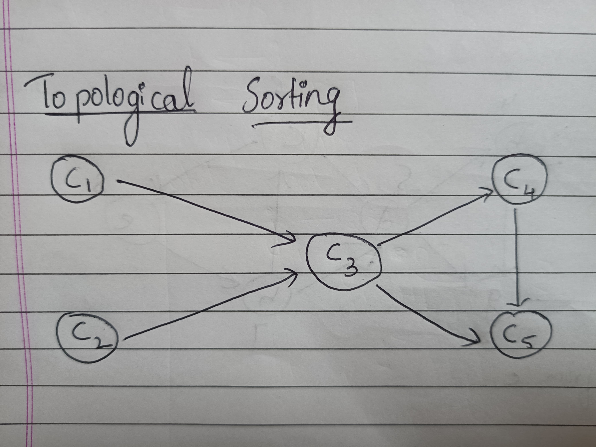

# CI/CD with GitHub Actions

GitHub Actions provides powerful features for automating continuous integration and continuous deployment (CI/CD) pipelines, enabling seamless software development and delivery workflows. This document outlines key concepts and practices for leveraging GitHub Actions effectively.

## Topological Sorting

Topological sorting is an algorithm used to linearly order vertices in a directed acyclic graph (DAG). It arranges vertices such that for every directed edge from vertex \( u \) to vertex \( v \), \( u \) comes before \( v \) in the ordering. This sorting is crucial in dependency management scenarios, ensuring that tasks or jobs with dependencies are executed in the correct sequence. In continuous integration and continuous deployment (CI/CD) workflows, topological sorting determines the order of tasks such as building, testing, and deploying applications. For example, deploying an application to a production environment typically depends on successful build and test stages. The algorithm iteratively identifies vertices with no incoming edges (sources), processes them, and removes their outgoing edges until all vertices are ordered, ensuring efficient and reliable task execution.

### Time & Space Complexity Analysis:

| Algorithm           | Time Complexity               |
|---------------------|-------------------------------|
| Topological Sorting | O(V + E), where V is vertices and E is edges | 

| Algorithm                        | Space Complexity           |
|----------------------------------|----------------------------|
| Topological Sorting  | O(V), where V is vertices |

[Code for topological sorting in C++](../codes/topological_sort.cpp)

## Scheduling Algorithms

Priority scheduling is an algorithm used to prioritize tasks or jobs based on their assigned priority values. Each job is associated with a priority level, and the scheduling algorithm arranges jobs in order of ascending or descending priority. This method ensures that higher priority jobs are executed before lower priority ones, regardless of their arrival order. Priority scheduling is essential in scenarios where certain tasks require immediate attention or have critical deadlines, optimizing resource utilization and meeting performance objectives.

### Time & Space Complexity Analysis:

| Algorithm                        | Time Complexity            |
|----------------------------------|----------------------------|
|Priority Scheduling | O(n^2), where n is the number of jobs|

| Algorithm                        | Space Complexity           |
|----------------------------------|----------------------------|
| Priority Scheduling| O(1) |

[Code for Priority Scheduling in C++](../codes/p_scheduling.cpp)