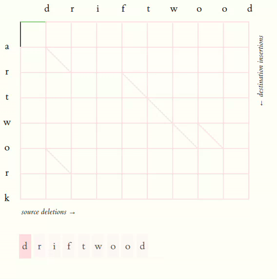

# Diff

In Git and GitHub, the diff functionality serves as a vital tool for developers to visualize and understand changes between file versions swiftly and effectively. This capability supports seamless code review, conflict resolution, and collaboration without requiring users to delve into the specifics of the underlying difference detection algorithms.

## Myer's Diff Algorithm

The Myers diff algorithm is a staple in text comparison tools like Git for efficiently identifying differences between files or versions. Named after Eugene Myers, it operates with a time complexity of O(N*D), where N is the total number of changes (insertions and deletions) and D is the maximum edit distance between the texts being compared. This linear complexity ensures that the algorithm scales well even with large files and complex codebases, making it suitable for real-world version control scenarios. Additionally, the Myers algorithm guarantees minimal edit scripts, providing developers with precise insights into code changes without unnecessary overhead.

In terms of space complexity, the Myers diff algorithm operates in O(N + D) space. This efficiency is achieved by maintaining linear space requirements relative to the size of the inputs and edit distance. The algorithm utilizes memory efficiently, storing only necessary data structures such as arrays for tracking diagonal paths in the edit graph. This minimal space usage contributes to its practicality in resource-constrained environments, allowing Git and similar tools to perform fast and memory-efficient diff operations across various file types and sizes.

### Time & Space Complexity Analysis:

| Algorithm                        | Time Complexity            |
|----------------------------------|----------------------------|
| Myers Diff                       | O(N * D), where N is the number of changes and D is the maximum edit distance |

| Algorithm                        | Space Complexity           |
|----------------------------------|----------------------------|
| Myers Diff                       | O(N + D), where N is the number of changes and D is the maximum edit distance |

[Code for Myer's in C++](../codes/myers.cpp)