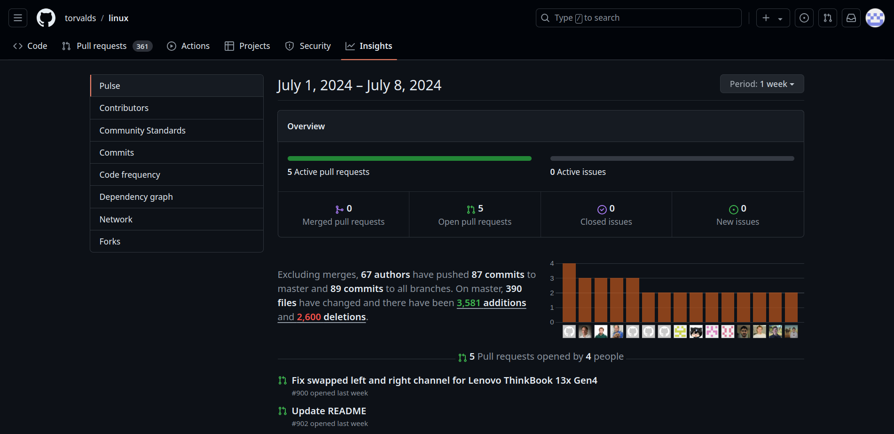

# Insights and Analytics

GitHub's insights and analytics capabilities provide valuable metrics and visualizations that empower businesses to gain deep understanding and optimize their codebase and development workflows. These tools offer insights into code contributions, pull request lifecycles, issue resolution times, and collaboration patterns among team members. By tracking metrics such as code frequency, commit history, and repository traffic, GitHub enables organizations to make data-driven decisions, identify bottlenecks, improve code quality, and streamline development cycles. These analytics not only enhance productivity but also foster transparency and accountability within development teams, ensuring alignment with business goals and continuous improvement in software delivery processes.

The Commit Activity algorithm in GitHub employs time series analysis to delve into commit frequency and patterns within repositories. This approach enables developers and project managers to visualize how often changes are made to the codebase over time, identifying trends, peak periods of activity, and potential slowdowns. 

### Time & Space Complexity Analysis:

| Operation                      | Time Complexity             | Space Complexity        |
|--------------------------------|-----------------------------|-------------------------|
| Merge Sort                     | O(n*logn)                    | O(n)                    |

[Code for Commit history in C++](../codes/commit_history.cpp)