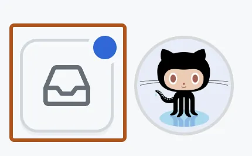

# Notifications

Notifications in GitHub are crucial for keeping users informed about activities relevant to their projects and interactions. They provide real-time updates on events such as pull request reviews, issue mentions, repository forks, and direct mentions in discussions. GitHub notifications help users stay informed about discussions they're involved in or repositories they're interested in, ensuring timely responses and active participation in collaborative workflows. Users can manage notifications through personalized settings, choosing to receive updates via email, web notifications, or both, based on their preferences. 

## Event Handling and Dispatch
 GitHub employs event-driven architecture to handle these events, where each event triggers specific actions or notifications based on predefined rules and user preferences. This approach enables seamless integration of real-time updates into the platform, enhancing collaboration and ensuring that users stay informed about critical activities within their projects. By efficiently managing event handling and dispatch, GitHub facilitates smooth communication, timely responses, and effective project management across its platform.

 