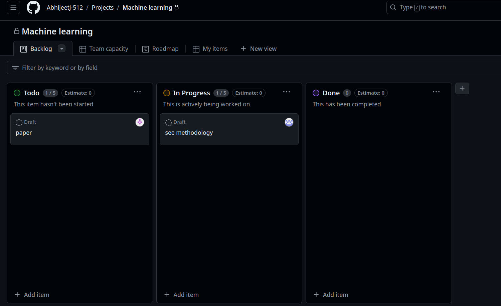

# Project Management and Collaboration

Effective project management and collaboration are essential aspects of GitHub's platform, facilitating seamless development workflows and team coordination. GitHub provides a range of tools and features designed to enhance productivity and collaboration among developers. Project boards allow teams to organize tasks, track progress, and prioritize work items using Kanban-style boards. This visual representation helps teams stay organized and enables transparent project management, ensuring that everyone involved has visibility into the status of tasks and projects.

## Kanban Boards
Kanban Boards on GitHub serve as powerful visual project management tools that facilitate efficient task organization and workflow management. Leveraging a straightforward list sorting algorithm with a time complexity of O(n*logn), Kanban boards enable teams to prioritize, track, and manage work items seamlessly. This visual representation allows for intuitive task management, providing transparency and clarity on the status of tasks across different stages of development. By utilizing Kanban boards, teams can streamline their processes, improve productivity, and ensure smoother collaboration, thereby enhancing overall project success and delivery on GitHub.

### Time & Space Complexity Analysis:

| Operation                      | Time Complexity             | Space Complexity        |
|--------------------------------|-----------------------------|-------------------------|
| Merge Sort                     | O(n*logn)                    | O(n)                    |

[Code for list sorting in C++](../codes/merge_sort)