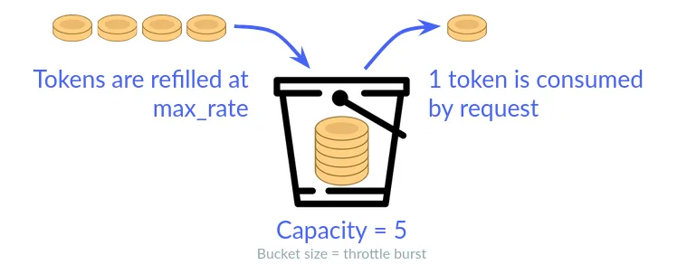

# Rate Limiting

Rate limiting in GitHub is a crucial mechanism designed to control the number of API requests a user or application can make within a specific time frame. This helps ensure the stability and performance of GitHub's services by preventing abuse and overuse of resources. Each authenticated user is allotted a certain number of requests per hour, with different limits for various types of requests and authentication methods. If the rate limit is exceeded, subsequent requests will be denied until the limit resets, typically within an hour. By enforcing rate limits, GitHub maintains fair usage policies, optimizes server load, and ensures a consistent experience for all users.

## Token Bucket Algorithm

The Token Bucket algorithm is a widely-used mechanism for rate limiting that allows a system to handle bursts of traffic efficiently while maintaining a steady request rate over time. In this algorithm, a "bucket" holds a fixed number of tokens, each representing the capacity to handle one request. Tokens are added to the bucket at a constant rate up to a maximum capacity. When a request is made, a token is removed from the bucket, allowing the request to proceed. If the bucket is empty (i.e., there are no tokens left), the request is denied or delayed until more tokens become available. This approach enables the system to handle short bursts of requests that exceed the average rate without dropping requests immediately, providing a flexible and responsive rate limiting mechanism.

### Time & Space Complexity Analysis

| Algorithm        | Time Complexity | Space Complexity |
|------------------|-----------------|------------------|
| Token Bucket     | O(1)            | O(1)             |
| Leaky Bucket     | O(1)            | O(1)             |

[Code for Token Bucket Algorithm in C++](../codes/bucket_code.cpp)