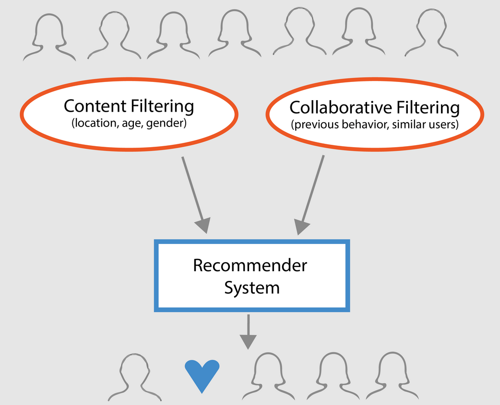

# Recommendation Systems

GitHub's recommendation system leverages collaborative filtering to suggest repositories, contributors, and projects based on user behavior and interests. Collaborative filtering works by analyzing patterns in user interactions, such as repository stars, forks, contributions, and follows. By identifying similarities between users and items, the algorithm can generate personalized recommendations. For instance, if a user frequently stars repositories related to machine learning, GitHub will recommend other popular machine learning repositories that similar users have also liked. This personalized approach helps users discover new projects, connect with like-minded developers, and find opportunities that align with their skills and interests, thereby enhancing their overall experience on the platform.

Collaborative filtering operates with a time complexity of O(m * n) for constructing the user-item matrix, where m is the number of users and n is the number of items. This step involves analyzing and creating a matrix that represents the interactions between users and items, capturing the preferences and behaviors of the user base. Once the user-item matrix is constructed, generating recommendations involves identifying the top k items for each user based on their past interactions and those of similar users, with a time complexity of O(k * log n) where k is the number of recommendations. This process ensures that the recommendations are relevant and tailored to the user's interests, facilitating a more engaging and productive experience on GitHub.

### Time & Space Complexity Analysis:

| Operation                      | Time Complexity             | Space Complexity        |
|--------------------------------|-----------------------------|-------------------------|
| User-Item Matrix Construction  | O(m * n)                    | O(m * n)                |
| Recommendation Generation      | O(k * log n)                | O(k + n)                |
