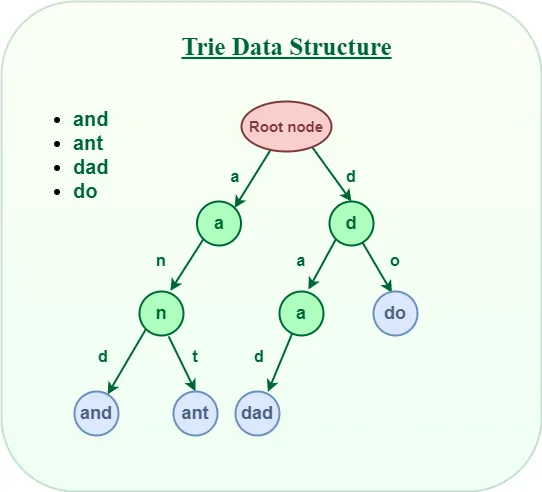

# GitHub Search Functionality

GitHub's search functionality empowers users to efficiently search within documentation and repositories, enabling seamless exploration and retrieval of information.

## Full-Text Search(Inverted Index Algo)
GitHub's full-text search feature is powered by an inverted index approach, which indexes documents and code repositories based on their content. This indexing method allows GitHub to preprocess and map terms to their occurrences efficiently. During querying, the algorithm retrieves documents relevant to the user's search terms, leveraging the indexed data structure for rapid retrieval. With time complexities optimized for both indexing (O(n log n), where n is the number of documents) and querying (O(k + log n), where k is the number of query terms), GitHub's full-text search ensures that even large and diverse repositories can be searched effectively.

### Time & Space Complexity Analysis:

| Algorithm        | Time Complexity             | Space Complexity         |
|------------------|-----------------------------|--------------------------|
| Inverted Index   | Indexing: O(n log n) | O(n)|
|                  | Querying: O(k + log n)  |O(n)|

[Code for inverted Index in python](../codes/inverted_index.py)

## Trie for Prefix Search

For users looking to explore repositories through prefix-based searches and autocomplete functionalities, GitHub utilizes trie (prefix tree) data structures. Tries excel in handling partial matches and predictive text suggestions by organizing and storing strings in a hierarchical manner. This allows GitHub's search to efficiently match prefixes against stored keys, providing responsive search results. With insertion and search operations optimized at O(m) time complexity, where m is the length of the key or prefix, trie structures enable GitHub users to quickly narrow down their search results based on specific starting characters or patterns.

### Time & Space Complexity Analysis:

| Algorithm        | Time Complexity             | Space Complexity         |
|------------------|-----------------------------|--------------------------|
| Trie (Prefix Tree)| Insertion: O(m)    | O(n * m)  |
|Trie (Prefix Tree)| Search: O(m)    |    O(n * m)  |

[Code for trie in C++](../codes/prefix_tree.cpp)