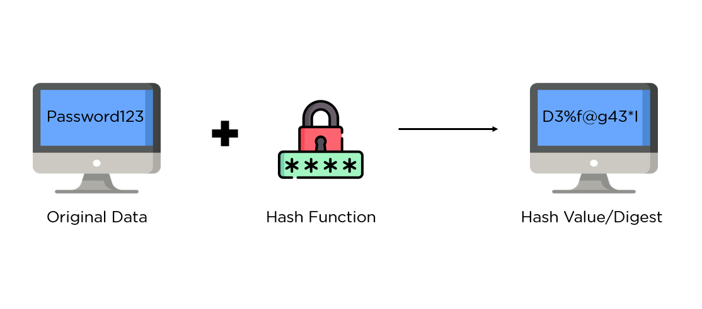
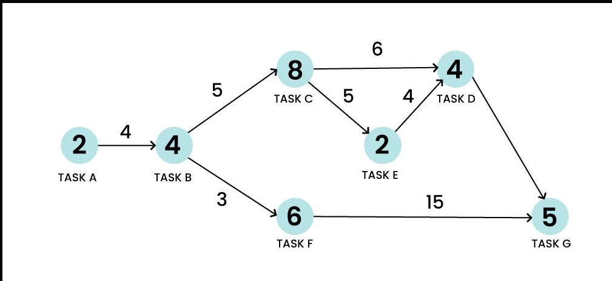

# Version Control

Version control is a system that tracks changes to files over time, allowing multiple people to collaborate on a project. It helps manage and document revisions, enabling users to revert to previous versions if needed.
These systems are essential for software development, ensuring code integrity and facilitating teamwork. By maintaining a history of changes, version control systems help prevent conflicts and loss of data.

## SHA-1 Usage in Git

SHA-1 (Secure Hash Algorithm 1) is integral to Git's core functionality, ensuring data integrity and efficient version control operations. In Git, every piece of data—whether it's a file, commit, or directory—is stored as an object identified by a unique SHA-1 hash. This hash is computed based on the content and type of the object, providing a reliable means to verify data consistency across repositories. When you commit changes in Git, the SHA-1 hash of the commit is calculated, representing a snapshot of the repository's state. This hash is then used to track changes, establish parent-child relationships between commits, and maintain a secure, verifiable history of project modifications.

Git's use of SHA-1 extends beyond versioning. It enables efficient data storage by leveraging content-addressable storage. Identical content across different commits or repositories will share the same SHA-1 hash, minimizing redundant storage. Moreover, Git uses SHA-1 hashes to ensure data integrity during operations like cloning, fetching, and merging. Each object's SHA-1 hash is recalculated and compared to detect any tampering or corruption, providing robust security measures. While SHA-1's vulnerabilities to collision attacks have prompted a shift towards stronger hash functions like SHA-256 in cryptographic applications, its foundational role in Git remains pivotal for maintaining the reliability and integrity of versioned data.

However, SHA-1 is an aging algorithm vulnerable to collision attacks, which can compromise security in cryptographic contexts. Therefore, modern cryptographic practices increasingly recommend transitioning to stronger hash functions like SHA-256 for enhanced security and resilience against potential vulnerabilities.

### Time & Space Complexity Analysis:

| Algorithm | Time Complexity |
|-----------|-----------------|
| SHA-1 | O(n), where n is the size of the input data |

| Algorithm | Space Complexity |
|-----------|------------------|
| SHA-1  | O(1), as SHA-1 produces a fixed-size output regardless of input size |

[Code for SHA-1 in python](../codes/sha_1.py)

## Directed Acyclic Graph (DAG) in Git

The Directed Acyclic Graph (DAG) is fundamental to Git's functionality, representing the commit history in a structured and efficient manner. In Git, each commit points to one or more parent commits, forming a graph with no cycles. This ensures a clear and traceable lineage of changes, allowing developers to navigate the project's evolution with ease. By utilizing a DAG, Git can efficiently manage branches, merges, and histories, providing a robust framework for version control.

Git's use of a DAG extends beyond simple commit tracking. The structure allows for efficient and complex operations such as finding common ancestors of commits, visualizing the project's history, and simplifying merges. By organizing commits in a hierarchical graph, Git ensures that the project's history is both accurate and easily navigable. This structure is crucial for supporting features like branching, where multiple lines of development can proceed concurrently without conflict.

To traverse and manipulate the DAG, Git employs algorithms like Depth-First Search (DFS). This enables Git to perform operations with a time complexity of O(V + E), where V is the number of commits (vertices) and E is the number of parent-child relationships (edges). The DAG's acyclic nature prevents conflicts and ensures that each commit has a unique and clear history, facilitating collaborative development and maintaining the integrity of the project’s timeline.

### Time & Space Complexity Analysis:

| Algorithm | Time Complexity |
|-----------|-----------------|
| Depth-First Search (DFS) for DAG | O(V + E), where V is the number of vertices (commits) and E is the number of edges (parent-child relationships)|

| Algorithm | Space Complexity |
|-----------|------------------|
|Depth-First Search (DFS) for DAG| O(V), where V is the number of vertices (commits), since additional space is needed for the visited array and the recursion stack |

[Code for DFS in C++](../codes/DFS.cpp)