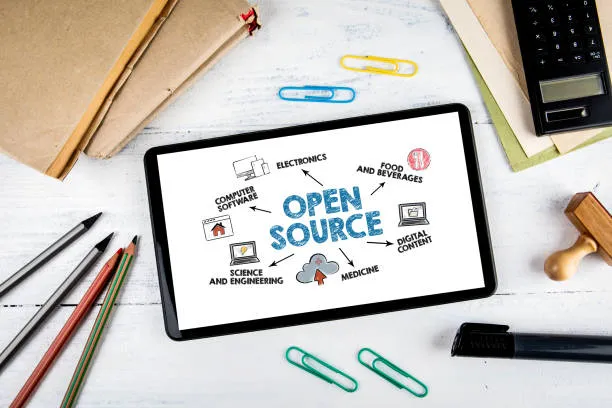
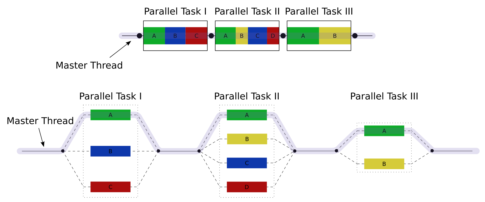

# Open Source

Open source refers to software where the source code, the building blocks of the program, is freely available for anyone to inspect, modify, and distribute. This collaborative approach fosters innovation as programmers can tinker, improve, and share modifications, leading to a richer and more secure software ecosystem.
GitHub has become a central hub for open source development, fostering a global community of contributors and projects. By providing tools for version control, collaboration, and project management, 

## Fork-join(manily parllel computing)
The fork-join algorithm is a parallel computing model used to manage contributions in GitHub's fork and pull request system. This algorithm divides a task into smaller sub-tasks (forks), processes them in parallel, and then combines the results (joins). In the context of GitHub, when a developer forks a repository, they create an independent copy to make changes. Once the changes are made, a pull request is initiated to merge the modifications back into the original repository. The fork-join approach ensures that multiple contributors can work on different parts of a project simultaneously, enhancing efficiency and reducing the time required to integrate changes. The algorithm operates with a time complexity of O(n), where n represents the number of tasks or changes being managed. This enables efficient handling of numerous contributions, facilitating seamless collaboration and continuous improvement in open source projects.

The algorithum used is similar to merge sort where the tasks are divide and later combined to give a single result.

